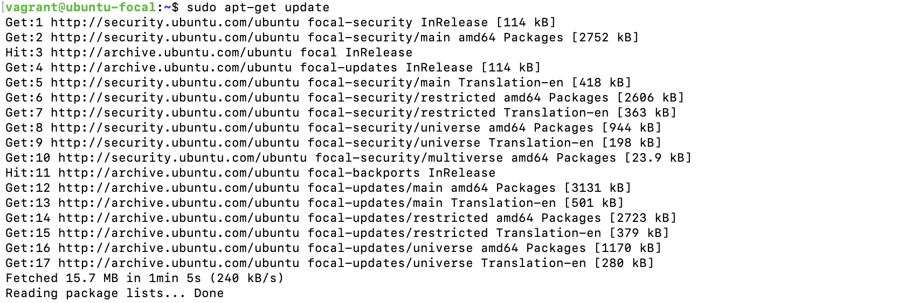
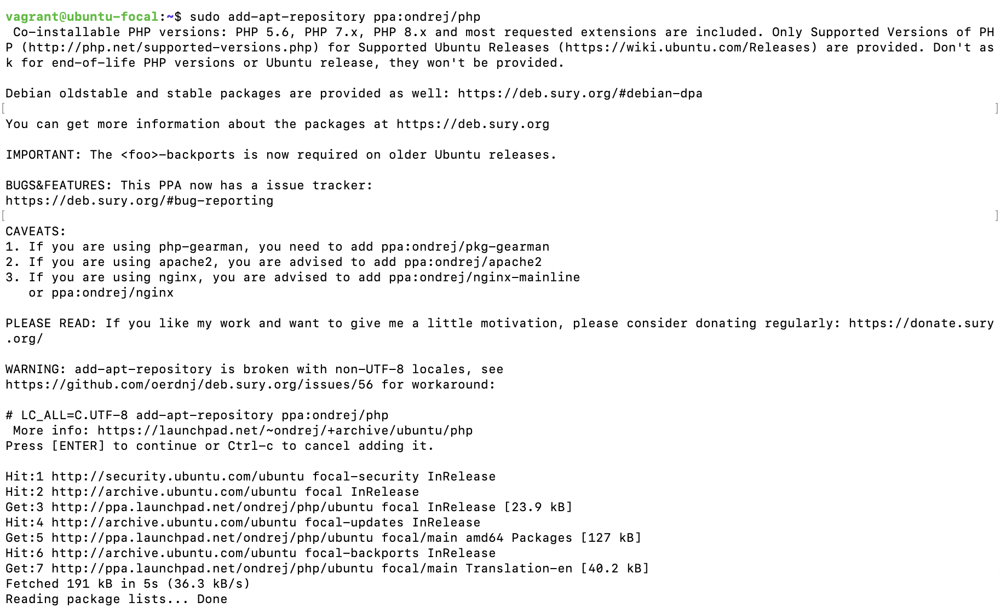
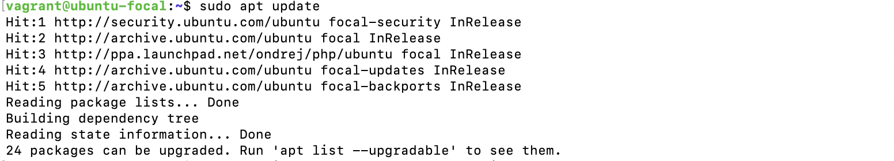
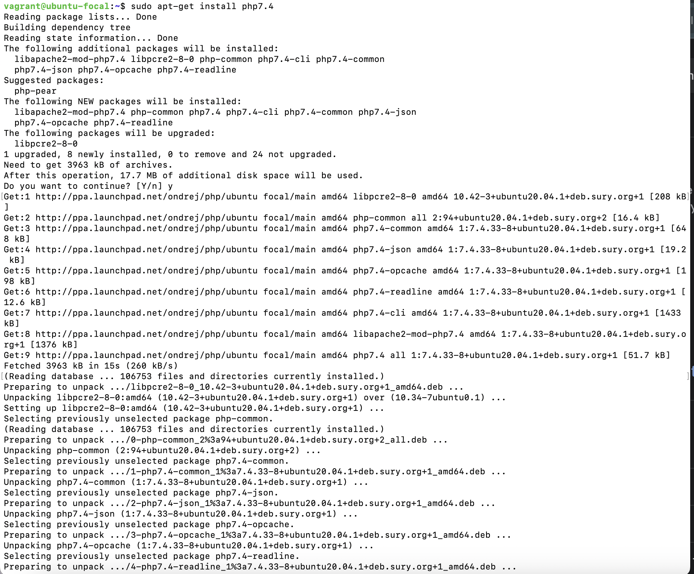
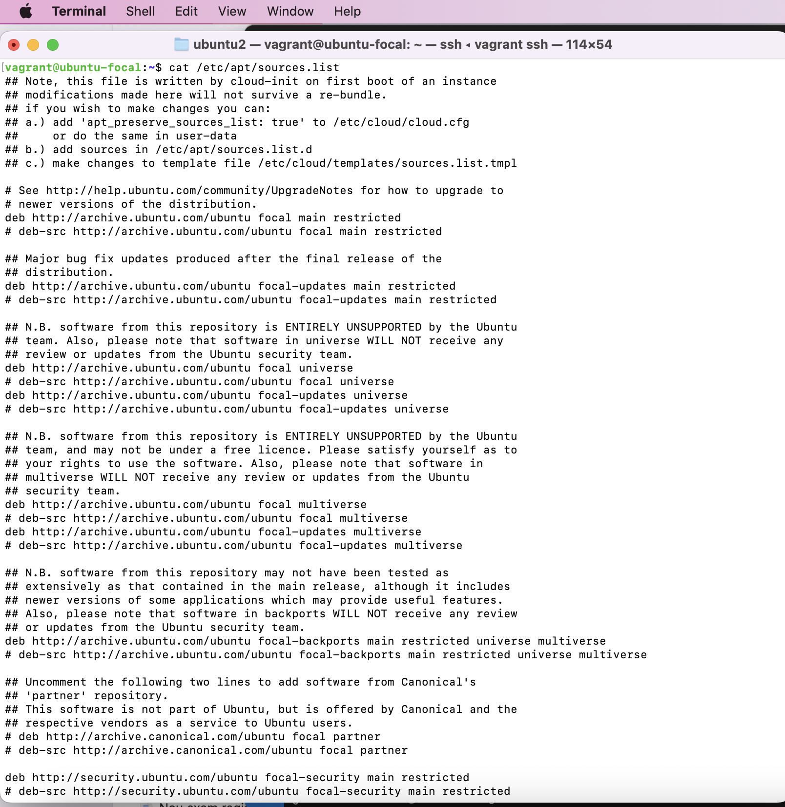
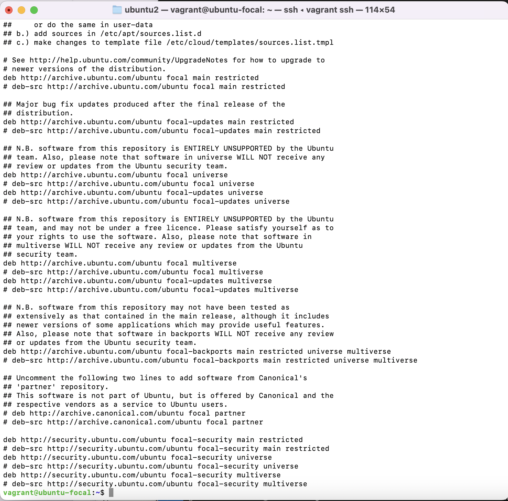

# Package installation from a repository

Task:

Install PHP 7.4 on your local linux machine using the ppa:ondrej/php package repo.
Instruction:

Learn how to use the add-apt-repository command
Submit the content of /etc/apt/sources.list and the output of php -v command.

## Solution
In order to install php7.4 on my linux machine, I carried out the following steps:

1. I checked if php was already installed on my machine by running the `php -v` command.

2. Since php was not installed on my computer, I proceeded by updating my existing packages with the `apt-get update` command.

3. Once the update was complete, I proceeded to add the **ppa:ondrej/php** using the `add-apt-repository ppa:ondrej/php` command.
 

4. Then I updated my package repository again, this time using just the `apt update` command, because I realised the `apt-get` and `apt` do the same package management function.

5. After adding the repository, I proceeded to install php 7.4 by running `apt-get install php7.4` command.

6. Once the installation was complete, I ran tht `php -v` command to confirm that php7.4 was installed on my machine. The version was displayed, showing that php7.4 was installed on my machine.

### Content of /etc/apt/sources.list

### Output of php -v command

