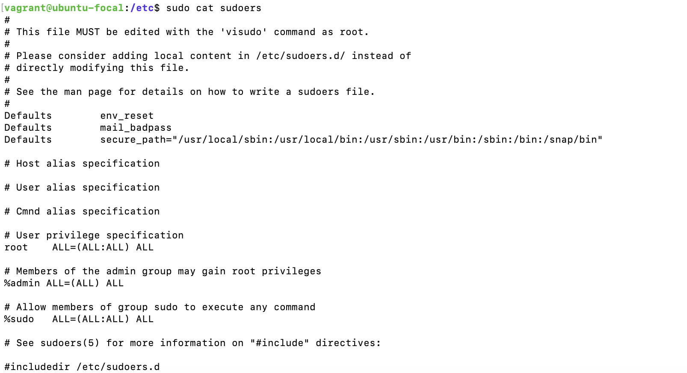
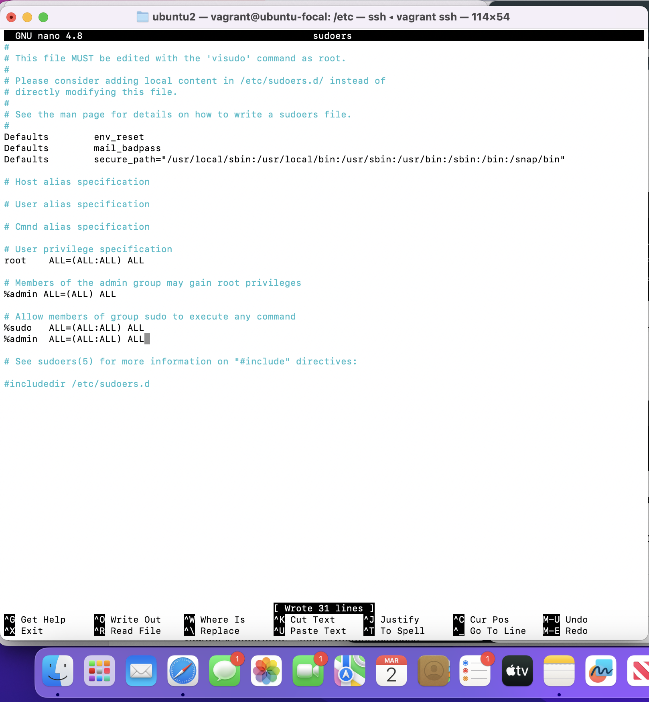
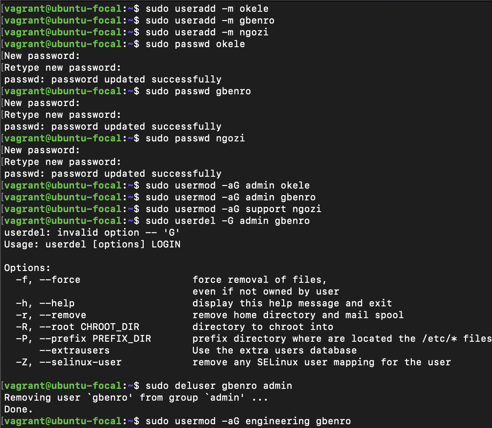
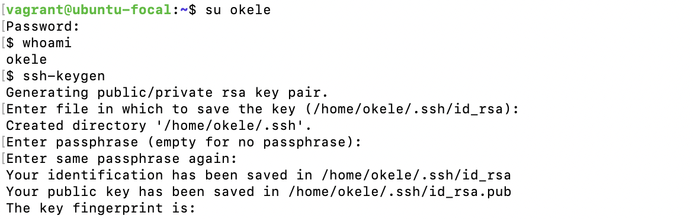
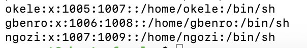
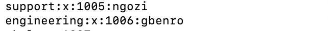
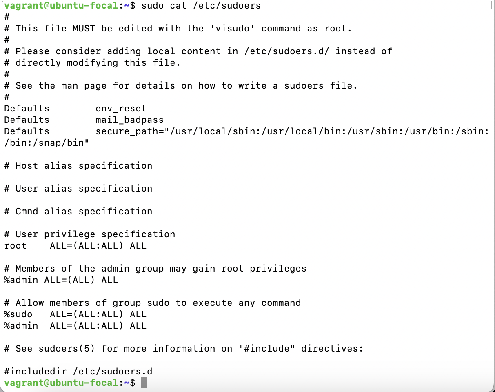

# Exercise on Users and Group
Exercise:
Create 3 groups – admin, support & engineering and add the admin group to sudoers. 
Create a user in each of the groups. 
Generate SSH keys for the user in the admin group

Instruction:
Submit the contents of /etc/passwd, /etc/group, /etc/sudoers

## Solution
1. I created the groups, "admin, support & engineering" using the `groupadd` command. [Please not that the admin group already existed on my machine, hence the error message]

    

2. To add admin group to sudoers, I edited the "sudoers" file in the "etc" directory. I first viewed the content of sudoers with the `cat` command, then I edited the sudoers file using the nano editor, adding the admin group to the sudoers.

    

    

    

3. I created 3 users (okele, gbenro & ngozi) using the `useradd` command, and added one of them to the three groups I created earlier with the `usermod` command and `-aG` flags. I mistakenly placed more than one user in the admin group and had to remove the user from the group by running the command `deluser username groupname`.

    

4. To generate SSH keys for the user (okele) I added to the admin group, i had to log into the user via the `su username` command, afterwhich I rant the `whoami` command to verify I had logged into the right user. After confirmation, I ran the `ssh-keygen` command for the generation of key pairs.
    
    
    
    The folders containg the public and private keys generated.
    

## Contents of /etc/passwd
 I `cat` /etc/passwd
    

## Contents of /etc/group
I `cat` /etc/group
    

## Contents of /etc/sudoers
I `cat` /etc/sudoers
    