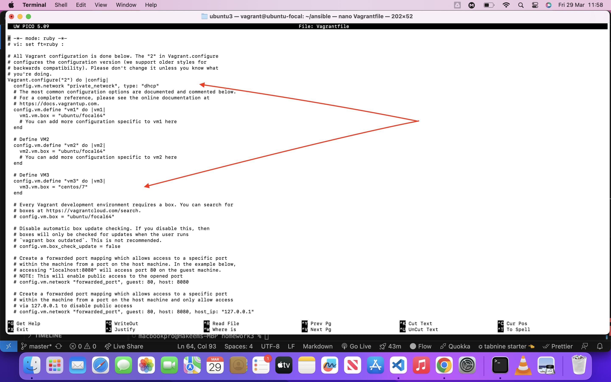
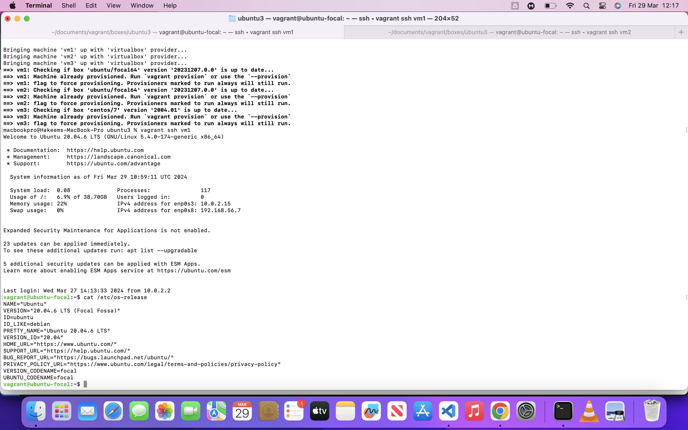
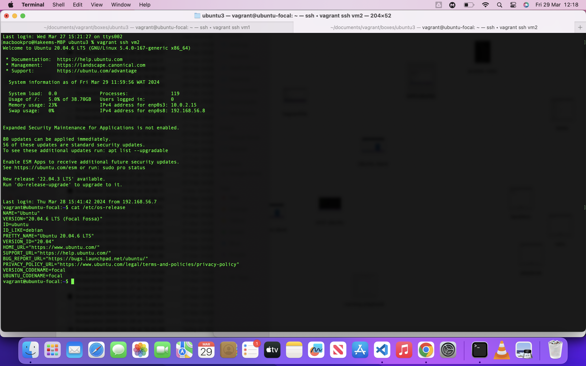
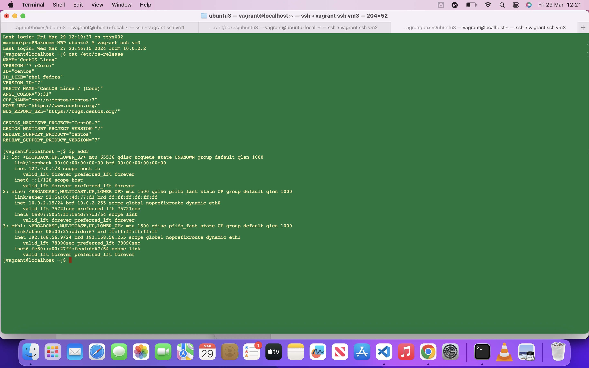
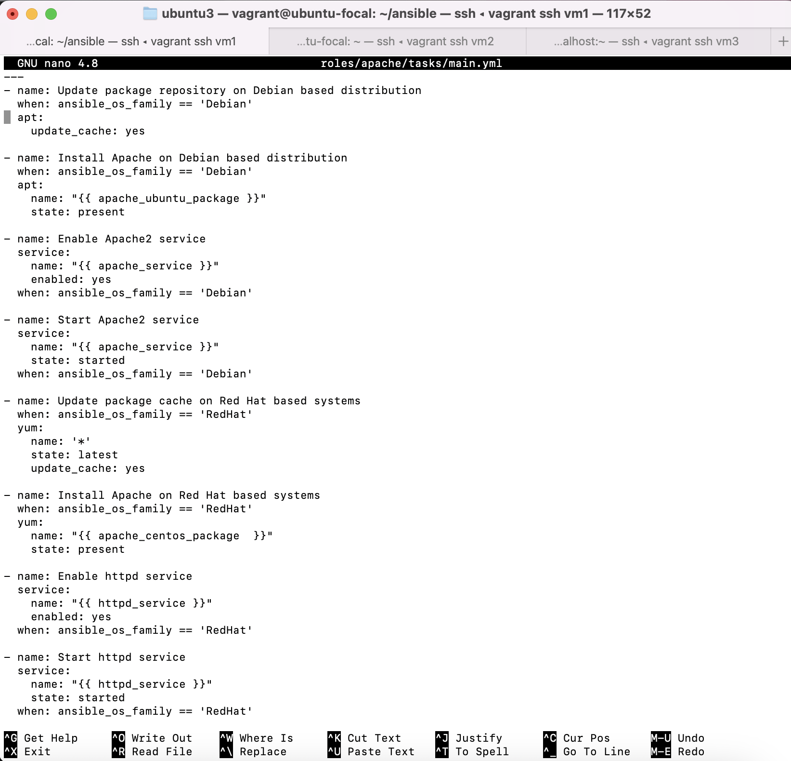
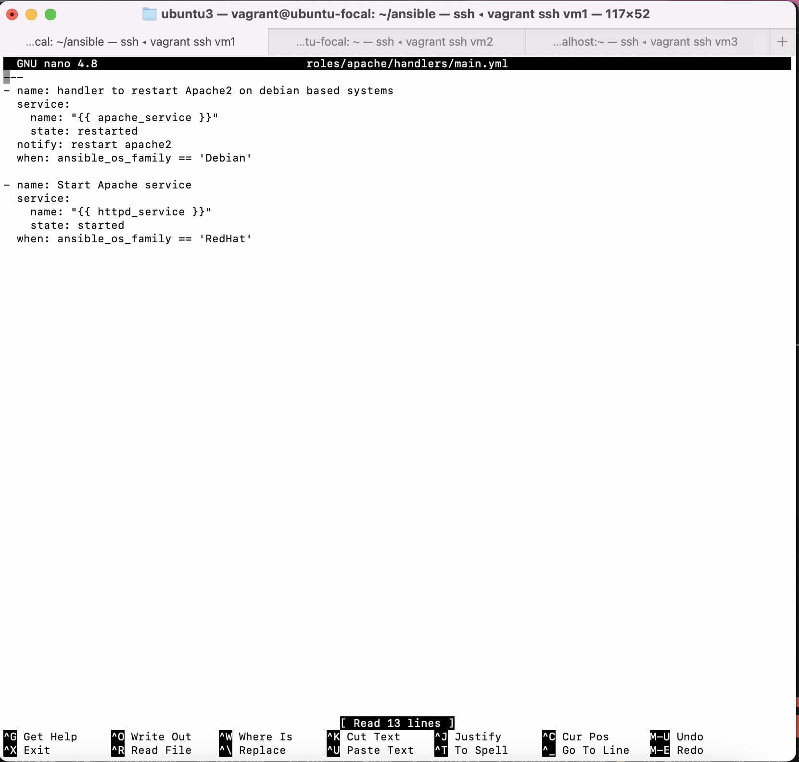
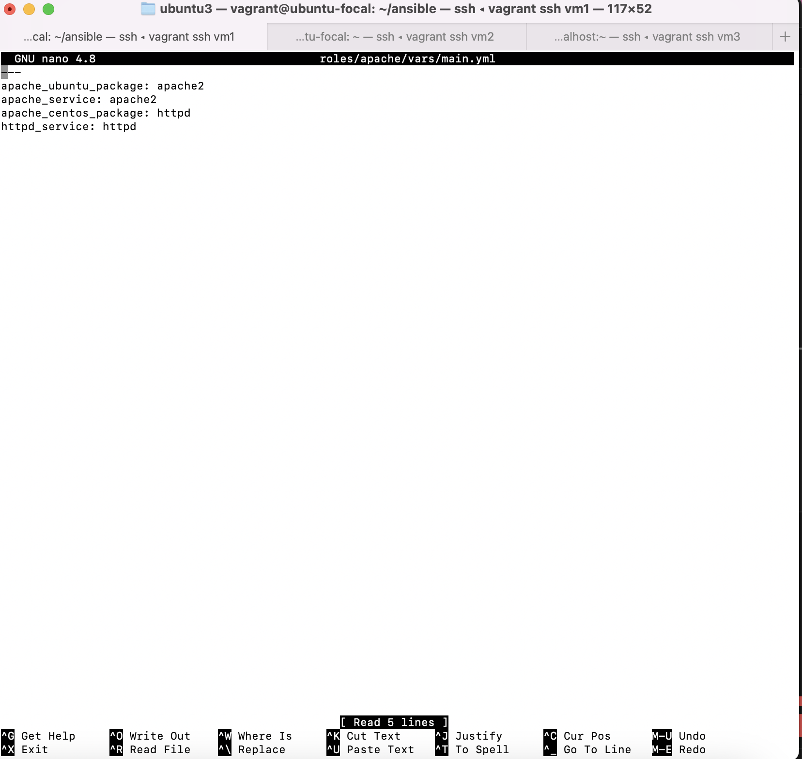
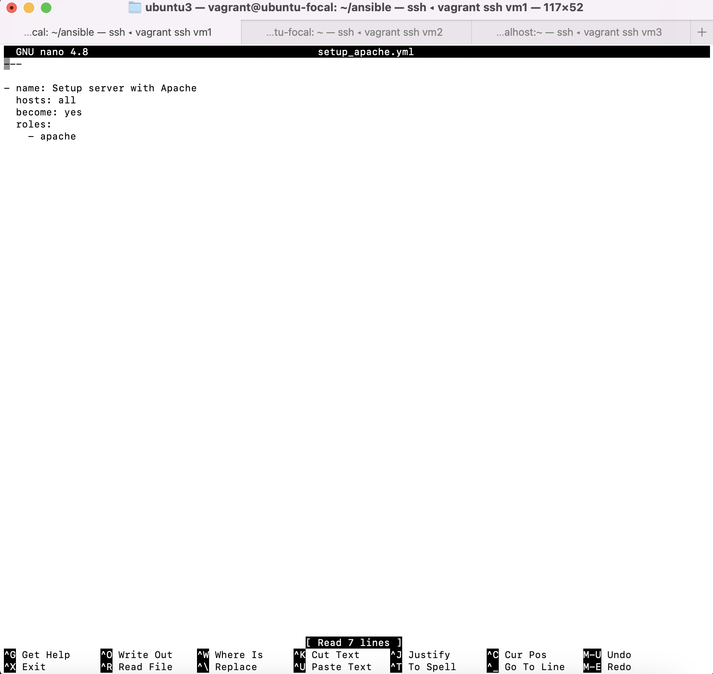

## Task:
Remember that task where you deployed an open source app on GitHub using Apache?
you would be deploying same but this time around using ansible.
Your ansible slave will consist of one ubuntu node and one centos(rhel) node.
Your master node can be of any Linux distribution of your choice(3 nodes in all).
Explore using variables in ansible while executing this task.

## Solution:

I used vagrant for this exercise. To spin up three nodes[Master (Ubuntu) and two slaves (Ubuntu & CentOS)], I had to configure my Vagrantfile to be able to spin up the three machines,and I also set it to dynamically assign IP addresses to the machines as shown below. The machines were assigned the following IP addresses; `192.168.56.7`, `192.168.56.8` & `192.168.56.9`. VM1 (ubuntu) is my master machine.

After spinning up my machines with `vagrant up` command, I `vagrant ssh` into all three machines, thus opening three tabs in my terminal as seen in the images below. 

VM1 (Ubuntu):

VM2 (Ubuntu):

VM3 (CentOS):

I then placed the public keys of my master machine in the authorized-keys folders of my slave machines to enable ssh connectivity. I tested it and proceeded to create my ansible playbook on my Master machine.

To make my ansible playbook clean and reusable, I made use of roles. My roles included, task, handlers and variables.

### Structure of my roles:

### Tasks:

I defined my tasks using ansible modules such as apt, yum, service and copy.
My playbook first updated the package repositories on my slave machines (ubuntu & CentOS), then it installed apache on them. After that was done, the playbook enabled apache on the slave machines. This was followed by copying the web files from my master machine to the `var/www/html` directory on the slave machines. On completion, it is set to notify my handler to restart the apache service on the slave machines.
[I used the when conditional statement to ensure that the right package was installed on the right machine, and also referenced variables from my vars role.]

### Handlers:

My handlers basicly restarted the apache service on the slave machines after receiving a notification upon completion of my copy task.

### Vars:

This basically holds the variables that I referenced in my tasks.

### Ansible Playbook:

The use of roles makes my playbook look very simple and easy to understand. The roles are referenced in the playbook and executed when the playbook is run, installing Apache web server on the slave machines, and also copying web files into the dedicated directory.

### Host Inventory:
This file contains the IP addresss for my slave machines.

#### Executing the Playbook:

I ran the command `ansible-playbook -i host_inventory setup_apache.yml` to install the Apache web server and copy the web files into the dedicated directory on the slave machines.

#### Viewing the websites on the slave machines servers:

I ran the Ip addresses of both slave machines on my browser, and the websites were loading fine.

This exercise shows how to make changes to other machines from a single master machine using ansible.