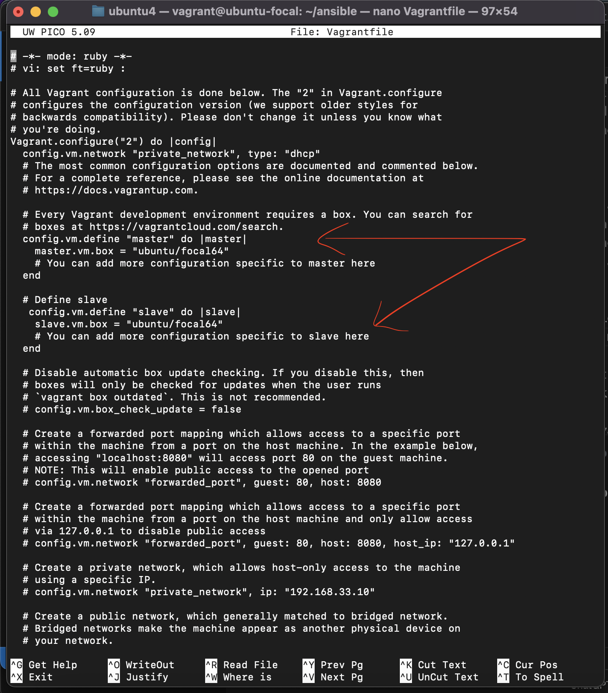
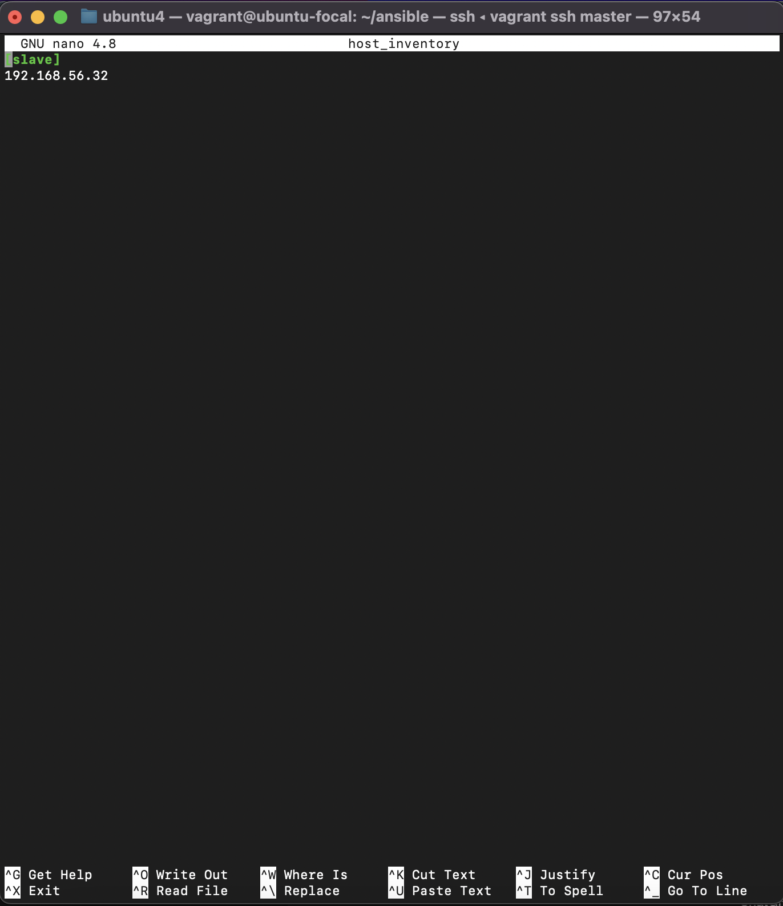

## Cloud Engineering Second Semester Examination Project
Cloud Engineering Second Semester  Cloud Engineering Second Semester Examination Project
IN PROGRESS
(Deploy LAMP Stack)

Objective
Automate the provisioning of two Ubuntu-based servers, named “Master” and “Slave”, using Vagrant.
On the Master node, create a bash script to automate the deployment of a LAMP (Linux, Apache, MySQL, PHP) stack.
This script should clone a PHP application from GitHub, install all necessary packages, and configure Apache web server and MySQL. 
Ensure the bash script is reusable and readable.
Using an Ansible playbook:
Execute the bash script on the Slave node and verify that the PHP application is accessible through the VM’s IP address (take screenshot of this as evidence)
Create a cron job to check the server’s uptime every 12 am.

Requirements

Submit the bash script and Ansible playbook to (publicly accessible) GitHub repository.
Document the steps with screenshots in md files, including proof of the application’s accessibility (screenshots taken where necessary)
Use either the VM’s IP address or a domain name as the URL.

## Solution
I automated the provisioning of two Ubuntu-based servers, named “Master” and “Slave”, using Vagrant by configuring my vagrant file.


After configuring it, I ran `vagrant up`, `vagrant ssh master` and `vagrant ssh slave` to spin up both nodes.


### Bash script
I broke down the objective of automating the deployment of a LAMP (Linux, Apache, MySQL, PHP) stack into smaller tasks (functions) that when called together deploy a LAMP stack.

Step 1: I declared my variables in my script.
```
# Variables
PROJECT_NAME="laravel"
PROJECT_DIRECTORY="/var/www/$PROJECT_NAME"
MYSQL_DB="Project"
MYSQL_USER="Hakeem"
MYSQL_PASSWORD="vagrant"
```

Step 2: I created a function that updates the repository, adds the php repository and installs all the necessary packages including Apache2, PHP 8.2 and its dependencies, Git, and other utilities.

```
# Function to update repository and install required packages
install_required() {
    sudo apt update -y
    sudo apt install apache2 -y
    sudo add-apt-repository ppa:ondrej/php -y
    sudo apt update -y
    sudo apt install php8.2 php8.2-curl php8.2-dom php8.2-mbstring 
    php8.2-xml php8.2-mysql zip unzip git -y
    sudo a2enmod rewrite
}
```

Step 3: Next, I created a function that installs Composer, a dependency manager for PHP, to manage the dependencies of the Laravel project.
```
# Function to install Composer
install_composer() {
    cd /usr/local/bin
    sudo curl -sS https://getcomposer.org/installer | sudo php -q
    sudo mv composer.phar composer
}
```

Step 4: I created a function to clone the Laravel project repository into the /var/www directory and set the appropriate ownership permissions.
```
# Function to clone Laravel repo and change ownership
clone_repo() {
    cd /var/www/
    sudo git clone https://github.com/laravel/laravel.git $PROJECT_NAME
    sudo chown -R $USER:$USER $PROJECT_DIRECTORY
}
```

Step 5: I created a function that installed the Composer dependencies and optimized the autoloader after cloning the repository.
```
# Function to install Composer dependencies
composer_dependencies() {
    cd $PROJECT_DIRECTORY
    composer install --no-interaction --optimize-autoloader --no-dev
    composer update --no-interaction
}
```

Step 6: I created function that builds a .env file from the example env file provided and configured Apache virtual host for the Laravel project.
```
# Function to create .env file
create_env() {
    sudo cp $PROJECT_DIRECTORY/.env.example $PROJECT_DIRECTORY/.env
    sudo chown -R www-data $PROJECT_DIRECTORY/storage
    sudo chown -R www-data $PROJECT_DIRECTORY/bootstrap/cache
}
```

Step 7: I created function to configure a new Apache virtual host for the project and disabled the default virtual host.
```
# Function to configure Apache
configure_apache() {
    sudo tee /etc/apache2/sites-available/$PROJECT_NAME.conf > /dev/null <<EOF
<VirtualHost *:80>
    ServerName localhost
    DocumentRoot $PROJECT_DIRECTORY/public

    <Directory $PROJECT_DIRECTORY>
        AllowOverride All
    </Directory>

    ErrorLog \${APACHE_LOG_DIR}/$PROJECT_NAME-error.log
    CustomLog \${APACHE_LOG_DIR}/$PROJECT_NAME-access.log combined
</VirtualHost>
EOF

    sudo a2ensite $PROJECT_NAME.conf
    sudo a2dissite 000-default.conf
}
```

Step 8: I I created function to install MySQL server and client, created a new database, and granted privileges to a user.
```
# Function to install and configure MySQL
install_configure_mysql() {
    sudo apt install mysql-server mysql-client -y
    sudo systemctl start mysql
    sudo mysql -uroot -e "CREATE DATABASE $MYSQL_DB;"
    sudo mysql -uroot -e "CREATE USER '$MYSQL_USER'@'localhost' IDENTIFIED BY '$MYSQL_PASSWORD';"
    sudo mysql -uroot -e "GRANT ALL PRIVILEGES ON $MYSQL_DB.* TO '$MYSQL_USER'@'localhost';"
}
```

Step 9: I modified the .env file to match my MySQL database configuration.
```
# Function to modify .env file
modify_env() { 
    sudo sed -i "23 s/^#//g" $PROJECT_DIRECTORY/.env
    sudo sed -i "24 s/^#//g" $PROJECT_DIRECTORY/.env
    sudo sed -i "25 s/^#//g" $PROJECT_DIRECTORY/.env
    sudo sed -i "26 s/^#//g" $PROJECT_DIRECTORY/.env
    sudo sed -i "27 s/^#//g" $PROJECT_DIRECTORY/.env
    sudo sed -i '22 s/=sqlite/=mysql/' $PROJECT_DIRECTORY/.env
    sudo sed -i '23 s/=127.0.0.1/=localhost/' $PROJECT_DIRECTORY/.env
    sudo sed -i '24 s/=3306/=3306/' $PROJECT_DIRECTORY/.env
    sudo sed -i '25 s/=laravel/='$MYSQL_DB'/' $PROJECT_DIRECTORY/.env
    sudo sed -i '26 s/=root/='$MYSQL_USER'/' $PROJECT_DIRECTORY/.env
    sudo sed -i '27 s/=/='$MYSQL_PASSWORD'/' $PROJECT_DIRECTORY/.env
}
```

Step 10: I created function to run Artisan commands to generate application key, create symbolic links, run migrations, and seed the database.
```
# Function to run artisan commands
run_artisan() {
    cd $PROJECT_DIRECTORY
    sudo php artisan key:generate
    sudo php artisan storage:link
    sudo php artisan migrate
    sudo php artisan db:seed
}
```

step 10: I created function to restart the Apache service to apply the changes.
```
# Function to restart Apache
restart_apache() {
    sudo systemctl restart apache2
}
```

Step 11: I created a master function called deploy and called it. This function executes all the other functions when called.
```
# Main deployment function
deploy() {
    install_required
    restart_apache
    install_composer
    clone_repo
    composer_dependencies
    create_env
    configure_apache
    restart_apache
    install_configure_mysql
    modify_env
    run_artisan
    restart_apache
    echo "Deployment successful"
}

# Execute deployment function
deploy
``` 

### Ansible
I set up ansible to push the bash script I created from my master node to my slave node, execute the script on the node, delete the script and add a cronjob tocheck server uptime at 12am everyday.

my ansible directory consists of the following files/directories; host_inventory, deploy_lamp_app_and_cron_job.yml and roles[directory].

Structure of my ansible directory:
```
ansible/
├── host_inventory
├── deploy_lamp_app_and_cron_job.yml
└── roles/
    └── lamp_deployment/
        └── tasks/
            └── main.yml
```

1. ansible/host_inventory

   In host_inventory, I list the target host's IP address under [slave]. This file helps organize hosts for Ansible tasks, enhancing management and scalability.
   

2. ansible/deploy_lamp_app_and_cron_job.yml

   deploy_lamp_app_and_cron_job.yml contains steps for deploying the LAMP app and setting up the cron job. It ensures readability and privilege escalation for task execution.
   

3. ansible/roles/lamp_deployment/tasks/main.yml

   My role is called lamp_deployment. In the role, tasks/main.yml runs the tasks. It contains modules to copy my script to the slave, execute it, remove it, and set up my cron job. 
   

I chose this approach because of reusability and maintenance of the playbook.

#### Cronjob
I ran into an interesting problem while attempting to create a cron job to check the server’s uptime every 12 am. The cron module in my playbook was not editing crontab files, which meant that I had to run my Ansible playbook just past 12 am to generate the log file I wanted. After discovering this limitation, I sought a solution that would write the cron job directly into the crontab file. This led me to use the lineinfile module to edit the /etc/crontab file and add my cron job. I realized that this approach is not limited to a particular user, which I found advantageous as it allows us to monitor the entire uptime for the system, regardless of the user.

After deploying via ansible, I checked to confirm my learnings.


I tested and ran my ansible playbook


Proof that LAMP was deployed successfully:


__*Thank you.*__